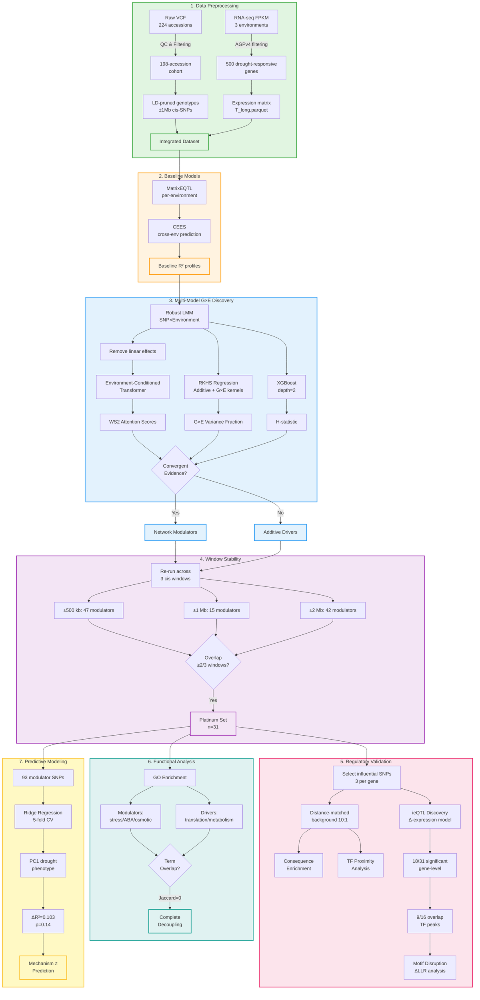

## Proximal cis-regulatory variants organize maize drought genotype-by-environment architecture


[](https://opensource.org/licenses/MIT)
[](https://www.python.org/)
[](https://www.r-project.org/)
[](#citation)


**Repository:** End-to-end reproducible pipeline for manuscript  
**Cohort:** 198 maize accessions × 3 water regimes (WW, WS1, WS2)  
**Focus:** 500 drought-responsive genes → 31 window-stable "platinum modulators"

---

## 📋 Overview

Classical GWAS excels at additive effects but obscures non-linear, environment-dependent regulatory logic. We resolve this by integrating:

- **Environment-Conditioned Transformer** (attention-based G×E detection)
- **RKHS variance partitioning** (additive vs interaction decomposition)  
- **Tree-based interaction metrics** (XGBoost H-statistic)

**Result:** A dual architecture distinguishing **network modulators** (proximal cis-regulatory, non-linear) from **additive drivers** (constitutive, linear).

### 🎯 Methodological Recipe

**Multi-model triangulation + window stability + regulatory grounding**

1. **Triangulate** across orthogonal learners to avoid model artifacts
2. **Test robustness** across cis-window definitions (±500 kb, ±1 Mb, ±2 Mb)
3. **Ground statistics** in genome features (TSS proximity, TF binding, regulatory consequences)
4. **Validate mechanistically** with ieQTL and motif disruption

---

## ✨ Key Discoveries

| Discovery | Evidence |
|-----------|----------|
| **Platinum Modulator Set** | 31 genes stable across ≥2/3 windows (7.85× enrichment, p=2.02×10⁻²⁸) |
| **Proximal Regulatory Control** | 49.5% SNPs in regulatory elements (3.48× vs background, p=4.84×10⁻¹⁴) |
| **TF Binding Proximity** | 2.93× enrichment within 1 kb of TF ChIP-seq peaks (p=1.81×10⁻³)<br/>*Source: Tu et al. 2020 maize leaf ChIP-seq (104 TFs), filtered z-score ≥3.0* |
| **ieQTL Validation** | 18/31 modulators significant at gene-level q < 0.10 (58%); 9/16 lead SNPs overlap TF peaks |
| **Functional Decoupling** | Zero GO term overlap (modulators: stress; drivers: constitutive) |
| **Mechanism ≠ Prediction** | Modest phenotypic gain (ΔR²=0.103, p=0.14) despite strong mechanistic signals |

---

## 🧬 Analysis Cohort

**198 maize accessions** (from 224) × **3 water regimes** (WW, WS1, WS2)  
**500 drought-responsive genes** → **31 platinum modulators**  
**Genome:** B73 RefGen_v4 (AGPv4) | **SNPs:** MAF ≥ 0.05, LD-pruned (r² < 0.2)

---

## 🔬 The Architecture

Modulators act as **environment-gated switches** at proximal regulatory elements, translating drought signals into transcriptional responses. Drivers maintain **baseline cellular infrastructure** with minimal G×E structure.

```
┌────────────────────────────────────────────────────┐
│  NETWORK MODULATORS (n=31)                         │
│  • Non-linear, environment-dependent               │
│  • TSS-proximal cis-regulatory control             │
│  • Stress/ABA/osmotic GO enrichment                │
│  • Window-stable (±500kb ↔ ±2Mb)                   │
│                                                    │
│  ADDITIVE DRIVERS (n=182)                          │
│  • Linear genetic effects                          │
│  • Translation/photosynthesis/metabolism           │
│  • Functionally decoupled (Jaccard=0 with mods)    │
└────────────────────────────────────────────────────┘
```

---

## 📊 Workflow Overview



---

## 🗂️ Repository Structure

```
📦 post-gwas/
│
├── 📄 README.md                                        # This file
├── 📄 Data_note.md                                     # Comprehensive data documentation
├── 📄 requrement.txt                                   # Python dependencies (note: typo in filename)
│
├── 📂 01_data_preprocessing/
│   ├── 📄 REPRODUCE_01_preprocessing.md                # Step-by-step preprocessing guide
│   ├── 📂 01_audit_inputs/
│   │   └── 📜 audit_raw_inputs.py                      # Audit of raw VCF, FPKM, and metadata integrity
│   ├── 📂 02_build_analysis_data/
│   │   ├── 📜 01_filter_expression_to_agpv4.py         # Filters FPKM files to retain only AGPv4 genes
│   │   └── 📜 02_prepare_model_inputs.py               # Generates all model-ready data (T_long, P, geno)
│   └── 📂 03_quality_control_outputs/
│       ├── 📜 03_check_cis_coverage.py                 # Validates SNP coverage for genes post-processing
│       └── 📜 04_verify_agpv4_ids.py                   # Confirms final files use strict AGPv4 format
│
├── 📂 02_transformer_modeling/
│   ├── 📄 REPRODUCE_02_transformer.md                  # Transformer training guide
│   ├── 📂 01_bundle/
│   │   └── 📜 build_transformer_bundle.py              # Assembles ECT data bundle with manifest
│   └── 📂 02_train_ect/
│       └── 📜 train_env_conditional_transformer.py     # Cross-validated ECT training with diagnostics
│
├── 📂 03_lmm_baselines_confirmatory/
│   ├── 📄 REPRODUCE_03_lmm.md                          # LMM analysis guide
│   ├── 📂 01_gene_selection_and_identifiers/
│   │   ├── 📜 01_correct_gene_identifiers.py           # Utility to normalize AGPv4 gene IDs
│   │   └── 📜 02_select_eqtl_informed_genes.py         # Selects the 100 target genes using published eQTL data
│   ├── 📂 02_primary_gxe_lmm_analysis/
│   │   ├── 📜 01_run_robust_lmm.py                     # Main LMM for G×E effects and ΔR² reported in manuscript
│   │   └── 📜 02_validate_lmm_results.py               # Generates diagnostic plots/summaries for the LMM
│   ├── 📂 03_baseline_and_comparative_models/
│   │   ├── 📜 01_run_baseline_matrix_eqtl.R            # Standard per-environment MatrixEQTL analysis
│   │   ├── 📜 02_run_cees_prediction.R                 # Cross-Environment eQTL Scoring (CEES) analysis
│   │   └── 📜 03_build_environment_gene_panels.R       # Builds per-environment gene panels for stability analysis
│   └── 📂 04_confirmatory_analysis/
│       ├── 📜 01_build_confirmatory_gene_set.py        # Builds the 21-gene list from top LMM results
│       └── 📜 02_analyze_confirmatory_set.py           # Runs and summarizes the confirmatory analysis
│
├── 📂 04_figures/
│   ├── 📄 REPRODUCE_04_figures.md                      # Figure generation guide
│   ├── 📂 infrastructure/
│   │   ├── 📜 colour_config.py                         # Centralized color palettes and styling
│   │   ├── 📜 data_loader_gwas.py                      # Curated data loading utilities for figures
│   │   └── 📜 stat_utils.py                            # Statistical helper functions
│   ├── 📂 main/
│   │   ├── 📜 figure_01.py                             # G×E architecture schematic & workflow
│   │   ├── 📜 figure_02.py                             # Positional and functional context of influential SNPs
│   │   ├── 📜 figure_03.py                             # Landscape and calibration of cis G×E associations
│   │   └── 📜 figure_04.py                             # Functional architecture and predictive leverage
│   └── 📂 supplementary/
│       ├── 📜 figure_s1.py                             # Window-stability of cis G×E calls
│       ├── 📜 figure_s2.py                             # Consequence- and distance-specific enrichment
│       ├── 📜 figure_s3.py                             # Proximity to transcription-factor binding
│       ├── 📜 figure_s4.py                             # Independent ieQTL validation
│       ├── 📜 figure_s5.py                             # Representative TF-proximal modulator loci
│       └── 📜 figure_s6.py                             # GO-term decoupling between modulators and drivers
│
└── 📂 05_postgwas_analysis/
    ├── 📄 REPRODUCE_05_postGWAS.md                     # Post-GWAS analysis guide
    ├── 📂 01_platinum_set_definition/
    │   ├── 📜 01_run_window_stability.py               # Window stability analysis across ±500kb/1Mb/2Mb
    │   └── 📜 02_select_influential_snps.py            # Selects top cis-SNPs for each platinum modulator
    ├── 📂 02_snp_characterization/
    │   ├── 📜 01_generate_matched_background.py        # Creates distance-matched control SNPs (10:1 ratio)
    │   ├── 📜 02_run_consequence_enrichment.py         # VEP consequence enrichment analysis
    │   └── 📜 03_run_tf_proximity_analysis.py          # TF binding site proximity analysis
    ├── 📂 03_functional_decoupling/
    │   ├── 📜 01_download_go_annotations.py            # Downloads AGPv4 GO annotations
    │   └── 📜 02_run_go_enrichment.py                  # Hypergeometric GO enrichment test
    ├── 📂 04_predictive_modeling/
    │   ├── 📜 01_prepare_nrs_data.py                   # Prepares data for nested ridge regression
    │   └── 📜 02_run_nrs_prediction.py                 # Ridge regression with 5-fold CV
    └── 📂 05_mechanistic_validation/
        ├── 📜 01_run_ieqtl_discovery.py                # Δ-expression ieQTL mapping with robust SE
        ├── 📜 02_finalize_ieqtl_results.py             # Gene-level FDR correction and summary
        ├── 📜 03_download_motif_data.py                # Downloads JASPAR plant PWMs
        ├── 📜 04_run_motif_disruption.py               # ΔLLR motif disruption analysis
        ├── 📜 05_attach_tf_families.py                 # Annotates TF families from JASPAR metadata
        └── 📜 06_generate_motif_summary.py             # Summarizes motif disruption results
```

---

## 🚀 Quick Start

### ⚡ One-Minute Setup

```bash
# Clone and install
git clone https://github.com/shoaibms/post-gwas.git
cd post-gwas
pip install -r requrements.txt

# R packages (for baselines)
Rscript -e "install.packages(c('data.table', 'MatrixEQTL', 'arrow', 'jsonlite'))"
```

### 📋 Prerequisites

- **Python** ≥ 3.9 | **R** ≥ 4.1 | **PLINK 2.0** (on PATH)
- **OS:** Windows/Linux/macOS
- **GPU:** Optional (PyTorch CPU/CUDA builds supported)

### ▶️ Run Order

Execute from project root. Each stage has a dedicated `REPRODUCE_*.md` guide.

```bash
# 01 → Preprocessing (see REPRODUCE_01_preprocessing.md)
python code/01_data_preprocessing/01_audit_inputs/audit_raw_inputs.py
python code/01_data_preprocessing/02_build_analysis_data/02_prepare_model_inputs.py

# 02 → Transformer (see REPRODUCE_02_transformer.md)
python code/02_transformer_modeling/01_bundle/build_transformer_bundle.py
python code/02_transformer_modeling/02_train_ect/train_env_conditional_transformer.py

# 03 → LMM + Baselines (see REPRODUCE_03_lmm.md)
Rscript code/03_lmm_baselines_confirmatory/03_baseline_and_comparative_models/01_run_baseline_matrix_eqtl.R
python code/03_lmm_baselines_confirmatory/02_primary_gxe_lmm_analysis/01_run_robust_lmm.py

# 04 → Figures (see REPRODUCE_04_figures.md)
python code/04_figures/main/figure_01.py  # Repeat for all figures

# 05 → Post-GWAS (see REPRODUCE_05_postGWAS.md)
python code/05_postgwas_analysis/01_platinum_set_definition/01_run_window_stability.py
python code/05_postgwas_analysis/05_mechanistic_validation/01_run_ieqtl_discovery.py
```

> **💡 Execution order:** 01 → 02 → 03 → (04 + 05 can run in parallel)

---

## 📖 Complete Documentation

**Step-by-step reproducibility guides:**

1. **[REPRODUCE_01_preprocessing.md](REPRODUCE_01_preprocessing.md)** → Data QC, AGPv4 filtering, PLINK2 pipeline
2. **[REPRODUCE_02_transformer.md](REPRODUCE_02_transformer.md)** → ECT bundle creation and training
3. **[REPRODUCE_03_lmm.md](REPRODUCE_03_lmm.md)** → Robust LMM, baselines (MatrixEQTL, CEES)
4. **[REPRODUCE_04_figures.md](REPRODUCE_04_figures.md)** → Main and supplementary figures (PNG + PDF)
5. **[REPRODUCE_05_postGWAS.md](REPRODUCE_05_postGWAS.md)** → Window stability, ieQTL, motif disruption

---

## 🗄️ Data & Software

### Analysis-Ready Artifacts

Generated by preprocessing pipeline; inputs for all downstream analyses:

| File | Description | Size |
|------|-------------|------|
| `T_long.parquet` | Expression (FPKM, long-format) | ~29.7M rows |
| `P.csv` | Phenotype data | 198 accessions |
| `gene_map.csv` | Gene coordinates (AGPv4) | ~39K genes |
| `cohort_pruned.pgen` | LD-pruned genotypes | 198 × SNPs |
| `pcs.eigenvec` | Population structure | 198 × 20 PCs |

*Files in `output/` subdirectories. See [Data_note.md](Data_note.md) for provenance.*

### Raw Data Sources

- **Expression:** Liu et al. (2020) *Genome Biology* 21:163 → NGDC GSA (CRA002002)
- **Genotypes:** Liu et al. (2020) → NGDC GVM (GVM000048)
- **Reference:** Ensembl Plants B73 RefGen_v4 (AGPv4)

> **Note:** We do not redistribute raw data. See [Data_note.md](Data_note.md) for download instructions.

### Software Stack

**Core:** Python 3.9+ | R 4.1+ | PLINK 2.0  
**Python:** pandas, numpy, scipy, scikit-learn, statsmodels, PyTorch, XGBoost, matplotlib, seaborn  
**R:** data.table, MatrixEQTL, arrow

*Complete frozen dependencies in `requrement.txt`*

---

## 💡 Methodological Innovations

| Innovation | Impact |
|------------|--------|
| **Multi-Model Triangulation** | Orthogonal learners (ECT, RKHS, XGBoost) avoid single-model artifacts |
| **Window Stability Auditing** | Platinum set requires ≥2/3 cis-window convergence (7.85× enrichment) |
| **Regulatory Grounding** | Distance-matched controls (10:1), VEP consequences, TF proximity, ieQTL |
| **Negative Controls** | Environment permutation (ΔR² −0.032), depth-1 XGBoost (H=0.015) |

**Validation:** BH-FDR q < 0.05 (standard), q < 0.10 (ieQTL gene-level) | Hypergeometric enrichment tests | Heteroscedasticity-robust SE | λ_GC = 0.62 (conservative)

---

## 🎯 Applications

### For Experimentalists
→ **CRISPR targets:** TF-overlapping, promoter-proximal variants with ieQTL support  
→ **Reporter assays:** Lead SNPs with motif disruption (ΔLLR evidence)  
→ **Mechanistic tests:** Which variants, conditions, and TFs drive response

### For Breeders
→ **Modulator markers:** Tune drought response curves  
→ **Driver selection:** Maintain yield stability  
→ **Environmental staging:** Optimize stress timing/intensity

### Translational Path
```
Statistical Signal → ieQTL Validation → MPRA/Base Editing → Field Testing
```

**Portable:** Heat, salinity, nutrient stress | Other crops | Developmental timing

---

## 🔍 Key Insights

### What Works
✅ **Multi-model convergence** resolves non-linear G×E as coherent regulatory class  
✅ **Window stability** separates biology from tuning artifacts (ρ ≈ 0.82 across windows)  
✅ **Proximal cis-control** concentrates at TSS-adjacent elements  
✅ **Functional decoupling** reveals distinct biological programs (stress vs constitutive)

### What Surprised Us
❗ **Mechanism ≠ Prediction:** Strong regulatory signals, modest phenotypic gain (ΔR²=0.103)  
→ *Explanation:* Polygenic buffering, trans-regulatory compensation, network degeneracy

❗ **Complete GO separation:** Zero term overlap (Jaccard=0) between modulators and drivers  
→ *Implication:* Fundamental biological distinction, not statistical artifact

❗ **High ieQTL success:** 58% at lenient FDR (q < 0.10) despite conservative λ_GC = 0.62  
→ *Interpretation:* True regulatory signal, not genomic inflation

---

## 📚 Citation

```bibtex
@article{maize_drought_gxe_2025,
  title={Proximal cis-regulatory variants organize maize drought genotype-by-environment architecture},
  author={[Authors]},
  journal={[Journal]},
  year={2025},
  doi={[DOI]}
}
```

**Key References:**
- Liu et al. (2020). Mapping regulatory variants in maize drought response. *Genome Biology* 21:163
- Zhang et al. (2021). Metabolome-mediated drought adaptation of maize. *Genome Biology* 22:260

---

## 📧 Contact & Contributing

**Lead Researcher:** Shoaib M. Mirza | shoaibmirza2200@gmail.com  
**Institution:** La Trobe University & Agriculture Victoria, Australia  
**Repository:** [github.com/shoaibms/post-gwas](https://github.com/shoaibms/post-gwas)

**Contributions welcome:** Fork → Feature branch → Pull request | Issues for bugs/questions

---

## 🙏 Acknowledgments

- Liu et al. (2020) and Zhang et al. (2021) for public maize drought datasets
- MaizeGDB and Ensembl Plants for reference genome resources
- [Funding sources and computational resources to be added]

---

## 📜 License

MIT License – See [LICENSE](LICENSE) for details

---

<div align="center">

**Multi-model convergence × Window stability × Regulatory validation**

*From statistical signals to testable biology*

    

</div>
